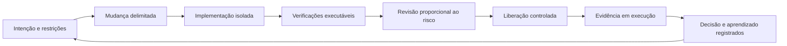

# Arquitetura evolutiva com agentes de IA

Author: Gilmar Pupo
Canonical: https://www.bpstrat.com.br/docs/arquitetura-engenharia/arquitetura-evolutiva-com-agentes-de-ia.html

---

# Arquitetura evolutiva com agentes de IA
{: .no_toc }


## Índice
{: .no_toc .text-delta }

1. TOC
{:toc}

Agentes de código reduzem o tempo necessário para produzir uma alteração. Eles
não demonstram, por isso, que a alteração preserva os limites do sistema, atende
ao requisito, pode ser operada ou será simples de reverter.

Quando a geração acelera mais que a capacidade de revisão, o gargalo apenas muda
de lugar. O time recebe mais código por unidade de tempo e precisa verificar mais
decisões, dependências e efeitos colaterais. A resposta arquitetural não é tentar
prever todo o sistema nem aceitar toda mudança que passa nos testes. É reduzir o
tamanho das decisões, tornar restrições relevantes verificáveis e usar o
resultado de cada mudança como entrada para a próxima.

Este documento aplica princípios de arquitetura evolutiva ao desenvolvimento
assistido por IA. Ele não define uma ferramenta obrigatória nem trata autonomia
como objetivo. O nível de delegação depende do risco, das permissões concedidas,
da qualidade das verificações e da capacidade de recuperação.

## Arquitetura não é a árvore de diretórios

Pastas e nomes podem tornar uma intenção visível, mas não provam que ela está
sendo respeitada. Um diretório chamado `domain` ainda pode depender de detalhes
de HTTP, banco de dados ou de um SDK externo. Um desenho com módulos separados
ainda pode esconder uma identidade compartilhada com privilégios amplos.

Para orientar uma mudança, diferencie três visões:

| Visão | Pergunta | Evidência possível |
| --- | --- | --- |
| Pretendida | Quais limites e propriedades queremos preservar? | ADR, especificação, modelo C4, contrato, política |
| Observada | Como código, dados e componentes estão organizados agora? | análise de dependências, configuração, inventário, diagrama conferido |
| Efetiva | O que o sistema realmente permite em execução? | testes, telemetria, políticas aplicadas, permissões e comportamento implantado |

Uma regra arquitetural só é operacional quando o time consegue relacionar a
intenção com alguma evidência observável. A estrutura de arquivos pode ser parte
dessa evidência; não deve ser a única.

## Evoluir exige direção e feedback

Em *Building Evolutionary Architectures*, a evolução é guiada por dimensões
arquiteturais consideradas importantes e por mecanismos que avaliam essas
características continuamente. Esses mecanismos são chamados de **fitness
functions**.

A ideia não é congelar uma arquitetura. É permitir mudanças incrementais sem
perder silenciosamente propriedades como isolamento, desempenho, segurança,
recuperabilidade ou custo aceitável.



O ciclo não garante que cada mudança melhore o sistema. Ele reduz o intervalo
entre uma decisão e a evidência de que ela preservou ou degradou uma propriedade
relevante.

## Classifique a mudança antes de delegar

O mesmo agente pode ser adequado para uma correção local e inadequado para uma
migração destrutiva. Antes da implementação, classifique a mudança pelo impacto
possível e pelo custo de recuperação.

| Classe | Exemplos | Execução assistida por IA | Controle mínimo |
| --- | --- | --- | --- |
| Reversível e local | texto, teste, refatoração interna delimitada | pode avançar com autonomia maior | workspace isolado, testes e revisão do diff |
| Reversível com efeito compartilhado | contrato compatível, nova dependência, configuração de serviço | execução delimitada e integração revisada | validação de consumidores, rollback e observabilidade |
| Difícil de reverter | migração de dados, mudança de identidade, exclusão, ação externa | preparar plano, simulação e artefatos; não executar por padrão | aprovação independente, backup ou estratégia de reversão testada |
| Irreversível ou regulada | perda de dados, pagamento, comunicação pública, decisão de acesso | agente pode analisar e propor; execução deve permanecer separada | autorização vinculada aos parâmetros, trilha de auditoria e responsabilidade definida |

Essa classificação é contextual. Alterar uma página estática pode ser local em
um repositório e representar uma comunicação regulada em outro. O critério deve
considerar consequência, não apenas tipo de arquivo ou comando.

## O limite precisa existir fora do prompt

O artigo usado como referência chama de *harness* a estrutura que envolve o
agente. Neste documento, o termo descreve apenas um **envelope de execução**. Não
é um padrão formal nem uma garantia de segurança.

Um envelope útil combina controles que o modelo não pode remover apenas por
reinterpretar uma instrução:

- **escopo de escrita:** caminhos e repositórios que podem ser alterados;
- **ferramentas permitidas:** comandos e APIs disponíveis para a tarefa;
- **identidade própria:** credenciais separadas, temporárias e com privilégio
  mínimo;
- **isolamento:** branch, workspace, container ou ambiente sem dados reais;
- **limites operacionais:** tempo, custo, tentativas, paralelismo e tamanho da
  mudança;
- **verificações externas:** testes, análise estática, contratos, políticas e
  fitness functions executados fora do modelo;
- **gates humanos:** aprovação para ações de alto impacto ou difíceis de
  reverter;
- **evidência:** diff, comandos executados, resultados, versão do artefato e
  pendências registradas.

Um prompt pode explicar o objetivo e orientar o comportamento. Autorização,
isolamento e bloqueio de uma ação não devem depender somente dele. A [OWASP AI
Agent Security Cheat
Sheet](https://cheatsheetseries.owasp.org/cheatsheets/AI_Agent_Security_Cheat_Sheet.html)
recomenda privilégio mínimo para ferramentas, aprovação de ações de alto
impacto, limites de recursos e separação entre decisão e execução irreversível.

## A especificação preserva intenção; as verificações preservam propriedades

O fluxo de [Spec-Driven Development
estratégico](/docs/metodologia/sdd/sdd-Spec-Driven-Development-estrategia.html)
mantém intenção, critérios e decisões fora da conversa transitória com o
agente. O [fluxo tático de
SDD](/docs/metodologia/sdd/sdd-Spec-Driven-Development-tatica.html) separa
especificação, planejamento, tarefas, implementação, validação e preservação dos
aprendizados.

Esses artefatos cumprem responsabilidades diferentes:

| Artefato | Responsabilidade | Não demonstra sozinho |
| --- | --- | --- |
| Especificação | comportamento desejado, escopo, critérios e restrições | viabilidade e aderência da implementação |
| Plano | decisões técnicas, alternativas, migração e rollback | que a decisão continua correta após o código |
| Tarefas | decomposição e dependências do trabalho | completude ou qualidade do resultado |
| Código e configuração | implementação observável | intenção original ou comportamento correto |
| Testes e fitness functions | evidência para propriedades delimitadas | ausência de falhas fora do que foi medido |
| Telemetria e revisão | comportamento implantado e interpretação do risco | correção futura sem nova observação |

A documentação oficial do Spec Kit apresenta o fluxo principal como **Spec →
Plan → Tasks → Implement**. Esse encadeamento fornece contexto estruturado, mas
não torna a saída correta automaticamente. Descobertas durante a implementação
precisam voltar ao artefato que contém a decisão correspondente.

## Mudanças pequenas tornam a revisão possível

Uma especificação extensa executada em uma única sessão pode trocar uma revisão
difícil por outra. Mudanças menores ajudam porque reduzem o número de hipóteses
avaliadas ao mesmo tempo e limitam o contexto necessário para entender o diff.

Uma fatia deve ter:

- objetivo e exclusões explícitos;
- critérios de aceitação observáveis;
- dependências conhecidas;
- fitness functions aplicáveis;
- procedimento de validação;
- caminho de reversão ou justificativa para sua ausência;
- condição clara de parada.

O tamanho adequado não é medido apenas por linhas. Uma alteração curta em uma
política IAM pode ter mais impacto que centenas de linhas isoladas. Use a classe
de risco e o alcance da mudança para decidir onde dividir.

## Decisões reversíveis não são decisões gratuitas

Interfaces, filas, feature flags, adaptadores e rollouts graduais podem reduzir
o custo de algumas mudanças. Eles também acrescentam indireção, estado,
contratos e operação. Não devem ser introduzidos apenas para manter toda opção
teórica aberta.

Para cada decisão relevante, registre:

```yaml
decision: "exemplo de decisão"
reason: "problema ou requisito que a exige"
reversibility: low | medium | high
reversal_cost: "dados, consumidores, indisponibilidade e trabalho envolvidos"
evidence: "teste, medição ou restrição observada"
review_trigger: "evento que exige nova avaliação"
owner: "papel responsável"
```

O campo `reversibility` é uma avaliação contextual, não uma escala universal.
Uma decisão pode ser tecnicamente reversível e contratualmente cara; outra pode
ser simples no código e difícil de desfazer depois que dados reais forem
gravados.

## O que deve permanecer na revisão humana

Automação é adequada para regras objetivas e repetíveis. A revisão humana ainda
precisa avaliar:

- se o problema e o resultado desejado foram compreendidos;
- se uma regra de negócio foi representada corretamente;
- se as alternativas e os custos fazem sentido para o contexto;
- se a mudança cria uma capacidade ou risco não coberto pelos testes;
- se uma exceção arquitetural é justificável;
- se a evidência é suficiente para o impacto possível;
- qual risco residual será aceito e por quem.

O objetivo não é reduzir a revisão humana a uma aprovação simbólica depois do
pipeline. É retirar dela verificações mecânicas para concentrá-la nas decisões
que ainda exigem interpretação e responsabilidade.

## Adoção incremental

Uma primeira aplicação pode caber em uma única mudança real:

1. escolha uma propriedade arquitetural que já causou ou pode causar um problema;
2. registre a intenção e a evidência atual;
3. selecione uma mudança pequena e reversível;
4. implemente uma fitness function que detecte a regressão relevante;
5. execute o agente em ambiente isolado e com permissões mínimas;
6. revise o diff, a saída das verificações e os riscos não medidos;
7. libere de forma controlada e observe o comportamento;
8. atualize a decisão com o que foi aprendido.

Só amplie a autonomia depois de demonstrar que os controles detectam falhas
reais, que o time consegue interromper a execução e que a recuperação foi
testada. Mais autonomia sem essa evidência aumenta capacidade de mudança e raio
de impacto ao mesmo tempo.

## Limitações

Arquitetura evolutiva não elimina decisões estruturais, revisão de design,
threat modeling, testes de segurança, observabilidade ou recuperação. Fitness
functions verificam apenas as propriedades que foram traduzidas em sinais
adequados. Uma regra mal escolhida pode bloquear boas mudanças ou permitir uma
degradação que mede o indicador errado.

Também não há base neste documento para prometer redução fixa de tokens, tempo
de revisão ou custo. Esses resultados dependem do modelo, do tamanho das
mudanças, da qualidade das especificações, da suíte de validação e do modo de
trabalho. Devem ser medidos no fluxo real da equipe.

## Referências

DIEGO BORGS. *Arquitetura Evolutiva com IA: Como Acelerar em Tempos Ágeis sem
Corromper o Sistema*. 19 ago. 2026. Referência de partida para a relação entre
arquitetura evolutiva, SDD, limites de execução e fitness functions. Disponível
em: [https://diegoborgs.com.br/blog/arquitetura-evolutiva-com-ia/](https://diegoborgs.com.br/blog/arquitetura-evolutiva-com-ia/).

FORD, Neal; PARSONS, Rebecca; KUA, Patrick; SUTHERLAND, Pramod. *Building
Evolutionary Architectures*. Síntese dos conceitos e das fitness functions.
Disponível em:
[https://evolutionaryarchitecture.com/precis.html](https://evolutionaryarchitecture.com/precis.html).

GITHUB. *Spec Kit Documentation*. Fluxo principal de Spec-Driven Development.
Disponível em: [https://github.github.com/spec-kit/](https://github.github.com/spec-kit/).

NATIONAL INSTITUTE OF STANDARDS AND TECHNOLOGY. *Secure Software Development
Framework (SSDF) Version 1.1*. NIST SP 800-218, 2022. Disponível em:
[https://csrc.nist.gov/pubs/sp/800/218/final](https://csrc.nist.gov/pubs/sp/800/218/final).

OWASP FOUNDATION. *AI Agent Security Cheat Sheet*. Disponível em:
[https://cheatsheetseries.owasp.org/cheatsheets/AI_Agent_Security_Cheat_Sheet.html](https://cheatsheetseries.owasp.org/cheatsheets/AI_Agent_Security_Cheat_Sheet.html).
