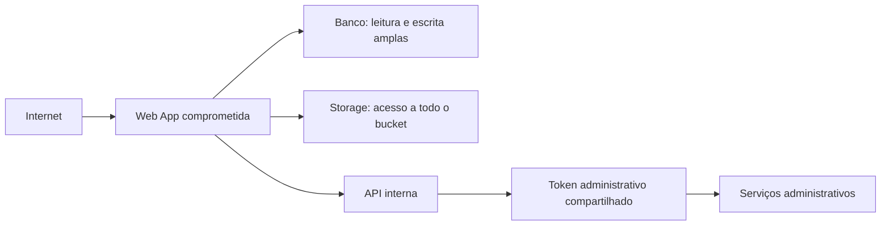
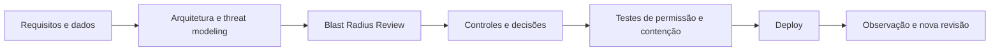

# Blast Radius Review

Author: Gilmar Pupo
Canonical: https://www.bpstrat.com.br/docs/arquitetura-engenharia/blast-radius-review.html

---

# Blast Radius Review: conter o incidente antes que ele se espalhe
{: .no_toc }

## Índice
{: .no_toc .text-delta }

1. TOC
{:toc}

Uma análise de segurança costuma começar pela possibilidade de uma aplicação,
credencial ou dependência ser comprometida. A **Blast Radius Review** acrescenta
outra pergunta à revisão arquitetural:

> Se este componente for completamente comprometido, até onde o problema
> consegue chegar?

A pergunta não substitui prevenção, correção de vulnerabilidades ou detecção.
Ela expõe uma dimensão diferente do risco: o alcance que a arquitetura concede
a um componente depois da primeira falha.

Neste documento, **Blast Radius Review** é o nome operacional de uma prática
proposta. Não se trata de um padrão formal. A prática aplica uma hipótese de
comprometimento para percorrer identidades, dados, conexões e ações, localizar o
próximo salto possível e decidir onde a arquitetura precisa de uma barreira.

## O risco também depende do alcance

Considere duas APIs com a mesma vulnerabilidade. A primeira consulta uma tabela
com uma identidade somente de leitura. A segunda usa uma conta administrativa,
alcança serviços internos e mantém uma credencial compartilhada com o pipeline
de implantação.

A vulnerabilidade pode ser igual, mas os incidentes possíveis são diferentes.
Para estimar o alcance, é necessário observar pelo menos:

- as identidades disponíveis ao componente;
- os dados que essas identidades podem ler, alterar ou excluir;
- os sistemas alcançáveis pela rede e pelas integrações;
- as ações destrutivas, irreversíveis ou externamente visíveis;
- as credenciais e relações de confiança que permitem um próximo salto.

Essa leitura é compatível com princípios de *zero trust*. A arquitetura descrita
no [NIST SP 800-207](https://csrc.nist.gov/pubs/sp/800/207/final) não concede
confiança implícita a uma conta ou ativo apenas por sua localização na rede ou
por pertencer à organização. Para uma Blast Radius Review, isso significa não
tratar a rede interna, uma service account ou um serviço conhecido como uma
barreira suficiente por si só.

## Como executar a revisão

### 1. Escolha um componente e uma fronteira

Comece por um componente exposto, privilegiado ou difícil de recuperar: uma
aplicação web, API, worker, pipeline, serviço de identidade, automação ou agente
de IA.

Defina também a fronteira da análise. Em um sistema menor, ela pode cobrir toda
a arquitetura. Em uma plataforma extensa, pode ser mais útil revisar um fluxo
crítico, um domínio ou um ambiente por vez.

O diagrama usado deve representar o estado implantado, não apenas a arquitetura
pretendida. Uma conexão esquecida ou uma permissão temporária que permaneceu em
produção faz parte do raio real.

### 2. Assuma o comprometimento

Durante a revisão, aceite a hipótese:

> O atacante controla o componente e pode usar tudo o que está disponível para
> ele.

Não é necessário decidir nesse momento se a entrada seria uma injeção de SQL,
execução remota de código, dependência comprometida, roubo de credencial, prompt
injection ou erro operacional. A técnica de entrada volta a importar em outras
análises. Aqui, o objetivo é descobrir o que acontece depois.

### 3. Levante as capacidades efetivas

Registre capacidades verificáveis, não descrições genéricas como “acessa o
banco” ou “integra com o storage”. Para cada relação, detalhe:

| Dimensão | Pergunta | Evidência útil |
| --- | --- | --- |
| Identidade | Quais tokens, chaves, certificados, papéis e service accounts ficam disponíveis? | Configuração de workload, cofre de secrets, política IAM, conteúdo efetivo do token |
| Dados | Quais registros, tenants, arquivos, backups e logs podem ser lidos ou alterados? | Grants do banco, políticas por linha, políticas do bucket, teste com a identidade real |
| Alcance | Quais destinos aceitam conexão a partir desse componente? | Política de rede, regras de firewall, rotas, teste de conectividade |
| Ações | O que pode ser criado, enviado, aprovado, modificado ou excluído? | Escopos da API, papéis, allowlists, teste de autorização |
| Próximo salto | Qual acesso obtido aqui permite comprometer outro sistema? | Credencial compartilhada, impersonação, API administrativa, caminho para secrets |

Configuração declarada é um ponto de partida. Quando o risco for relevante, a
evidência deve incluir um teste de permissão permitida e outro de permissão
negada.

### 4. Siga cada próximo salto

O caminho não termina no primeiro banco ou serviço alcançado. Pergunte o que o
atacante obtém ali e repita a análise até encontrar uma barreira verificável ou
chegar ao limite definido para a revisão.

Nesse exemplo, corrigir uma vulnerabilidade na Web App continua necessário,
mas não resolve o privilégio amplo nem a credencial compartilhada. A revisão
torna visível que uma única entrada pode alcançar serviços administrativos.

### 5. Registre barreiras, lacunas e decisões

Para cada caminho, classifique o que interrompe ou reduz a propagação:

- identidade exclusiva e com escopo mínimo;
- separação entre leitura, escrita e administração;
- isolamento por tenant ou por conjunto de dados;
- segmentação de rede com negação por padrão;
- credenciais curtas e não compartilhadas;
- aprovação independente para ações irreversíveis;
- limites de volume, custo, frequência ou duração;
- logs e alertas que permitam detectar e conter o uso indevido;
- recuperação testada para o recurso afetado.

Uma barreira não deve ser registrada como eficaz apenas porque existe no
diagrama. A revisão precisa indicar como ela foi ou será validada.

## Priorizando o que reduzir primeiro

Nem todo caminho encontrado exige a mesma resposta. Uma priorização prática
pode considerar:

1. quantidade e sensibilidade dos dados expostos;
2. possibilidade de alteração, exclusão ou ação externa;
3. número e criticidade dos próximos saltos;
4. capacidade de detectar o abuso durante sua execução;
5. tempo e evidência necessários para conter e recuperar;
6. custo e impacto operacional da barreira proposta.

Credenciais compartilhadas, acesso administrativo desnecessário e caminhos que
atravessam ambientes diferentes merecem atenção porque dificultam atribuição,
revogação e contenção. A correção, porém, precisa respeitar o contexto. Dividir
uma identidade pode aumentar a carga operacional; segmentar a rede pode quebrar
fluxos pouco documentados; exigir aprovação humana em toda ação pode tornar o
sistema inutilizável.

A decisão deve registrar qual incidente possível será reduzido, como o controle
será testado e qual risco continuará aceito.

## Agentes de IA tornam as capacidades parte do perímetro

Um agente pode receber acesso a documentos, e-mail, CRM, navegador, banco de
dados e APIs internas para completar uma tarefa. O valor operacional vem dessas
capacidades; o risco também.

A [OWASP AI Agent Security Cheat
Sheet](https://cheatsheetseries.owasp.org/cheatsheets/AI_Agent_Security_Cheat_Sheet.html)
recomenda conceder apenas as ferramentas necessárias, separar leitura de
escrita, limitar recursos acessíveis e exigir autorização explícita para ações
sensíveis. Ela também orienta tratar documentos, páginas, e-mails e respostas de
APIs como entradas não confiáveis.

Em uma Blast Radius Review de um agente, não basta revisar o prompt. É preciso
examinar os controles aplicados fora do modelo:

- o agente que consulta pedidos também pode cancelar ou reembolsar?
- a ferramenta de banco conecta com uma identidade mais privilegiada que a
  operação pretendida?
- um documento recuperado pode induzir uma chamada de ferramenta com efeito
  externo?
- a aprovação está vinculada à ação e aos parâmetros que serão executados?
- memória e contexto estão isolados entre usuários e tenants?
- uma falha em um agente pode delegar trabalho ou credenciais a outro?

Prompt injection é uma forma possível de iniciar o abuso, mas o tamanho do
incidente depende das capacidades que continuarem disponíveis. Instruções no
prompt podem orientar o comportamento; não devem ser o único mecanismo de
autorização.

## Onde a revisão entra no Secure SDLC

O [Secure Software Development Framework do
NIST](https://csrc.nist.gov/pubs/sp/800/218/final) recomenda integrar práticas
de segurança ao SDLC e usar modelagem de risco durante o design. A Blast Radius
Review pode funcionar como uma análise complementar dentro dessa etapa:

Além da primeira revisão de arquitetura, vale repeti-la quando houver:

- nova integração, identidade, ferramenta ou fonte de dados;
- mudança de escopos, papéis ou políticas de rede;
- inclusão de uma ação irreversível;
- alteração relevante em um agente, sua memória ou suas ferramentas;
- incidente que revele um caminho não modelado;
- divergência entre o diagrama e o ambiente implantado.

O resultado mínimo é um conjunto de caminhos de propagação, as barreiras já
validadas, as lacunas priorizadas, seus responsáveis e a data de revisão. Sem
esses artefatos, a conversa pode ser útil, mas será difícil verificar se o raio
foi reduzido depois.

## Uma versão de 30 minutos

Para uma primeira aplicação, reúna o diagrama atual e escolha um componente
crítico. Diante dele, responda:

1. Quais credenciais e identidades ele possui?
2. Quais dados consegue ler, alterar ou excluir?
3. Quais sistemas consegue alcançar?
4. Quais ações destrutivas, irreversíveis ou externas consegue executar?
5. Qual é o próximo sistema que poderia ser comprometido a partir dele?
6. Qual evidência demonstra que cada barreira realmente interrompe o caminho?

Se a análise atravessar vários sistemas sem encontrar uma negação de acesso,
uma identidade separada, uma aprovação independente ou outro limite testável,
ela encontrou um candidato concreto para redução de risco.

## Limitações

Blast Radius Review não identifica todas as formas de entrada, não calcula a
probabilidade de exploração e não prova que um sistema é seguro. Ela não
substitui threat modeling, revisão de código, análise de dependências, testes de
segurança, observabilidade, resposta a incidentes ou recuperação de desastre.

O resultado também perde validade quando inventários, diagramas e políticas não
representam a implantação real. A prática é mais útil como revisão repetível de
contenção do que como checklist executado uma única vez.

## Referências

NATIONAL INSTITUTE OF STANDARDS AND TECHNOLOGY. *Zero Trust Architecture*.
NIST SP 800-207, 2020. Disponível em:
[https://csrc.nist.gov/pubs/sp/800/207/final](https://csrc.nist.gov/pubs/sp/800/207/final).

NATIONAL INSTITUTE OF STANDARDS AND TECHNOLOGY. *Secure Software Development
Framework (SSDF) Version 1.1*. NIST SP 800-218, 2022. Disponível em:
[https://csrc.nist.gov/pubs/sp/800/218/final](https://csrc.nist.gov/pubs/sp/800/218/final).

OWASP FOUNDATION. *AI Agent Security Cheat Sheet*. Disponível em:
[https://cheatsheetseries.owasp.org/cheatsheets/AI_Agent_Security_Cheat_Sheet.html](https://cheatsheetseries.owasp.org/cheatsheets/AI_Agent_Security_Cheat_Sheet.html).
