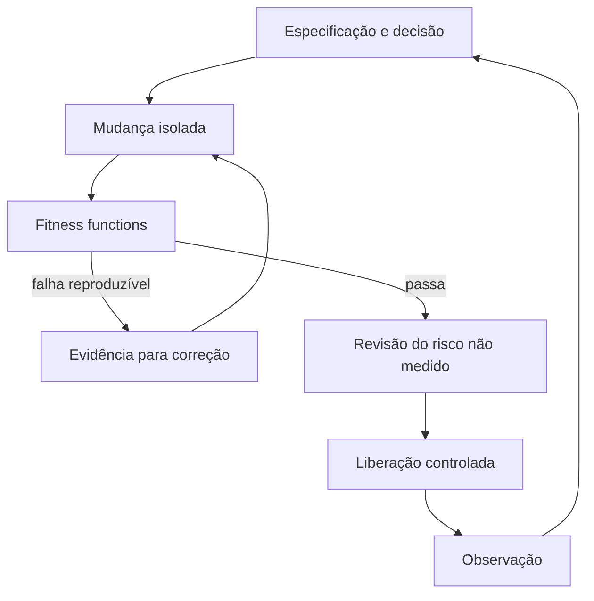

# Fitness functions arquiteturais

Author: Gilmar Pupo
Canonical: https://www.bpstrat.com.br/docs/arquitetura-engenharia/fitness-functions-arquiteturais.html

---

# Fitness functions arquiteturais: limites executáveis para mudanças
{: .no_toc }


## Índice
{: .no_toc .text-delta }

1. TOC
{:toc}

Uma decisão arquitetural escrita apenas em um documento pode desaparecer do
fluxo diário. Uma regra codificada sem explicar sua intenção pode continuar
bloqueando mudanças mesmo depois que o contexto deixou de existir.

Uma **fitness function arquitetural** liga essas duas partes: identifica uma
característica relevante do sistema e define como obter evidência de que ela
continua dentro de um limite aceito.

Exemplos incluem detectar dependências proibidas, medir latência sob uma carga
definida, verificar compatibilidade de contratos, impedir privilégios amplos ou
confirmar que um procedimento de restauração ainda funciona.

Nem toda fitness function precisa ser um teste executado a cada commit. Algumas
são contínuas, outras rodam antes de um deploy ou em revisões periódicas. Quando
a verificação não puder ser automatizada, ela ainda precisa ter método,
responsável, evidência e frequência definidos.

## Comece pela propriedade, não pela ferramenta

Adicionar um linter, scanner ou teste de arquitetura ao pipeline não define qual
problema ele deve impedir. Antes de escolher a implementação, responda:

1. Qual propriedade arquitetural precisa ser preservada?
2. Qual falha concreta tornaria essa propriedade inaceitável?
3. Qual sinal permite detectar a falha?
4. Em qual escopo e condição o sinal é válido?
5. Qual limite separa aceitação, alerta e bloqueio?
6. Quem interpreta exceções e mantém a função?
7. Quando a regra precisa ser revisada ou removida?

Uma formulação útil é:

> Para preservar **[propriedade]** no contexto **[escopo]**, mediremos
> **[sinal]** sob **[condição]**. Acima ou abaixo de **[limite]**, a ação será
> **[alertar, bloquear, reverter ou exigir revisão]**.

“O sistema deve ser rápido” não é verificável. “No cenário de leitura de pedido
com 50 usuários concorrentes e conjunto de dados definido, o P95 deve permanecer
abaixo do limite aceito pelo produto” já registra sinal, condição e decisão. O
valor do limite precisa vir do requisito e da medição do sistema, não de um
número copiado de outro projeto.

## Contrato mínimo da função

Registre a função perto da configuração ou do teste que a implementa. O formato
pode variar; os campos abaixo preservam a informação necessária para interpretar
o resultado:

```yaml
id: ARCH-DEPEND-001
property: "isolamento do domínio"
intent: "regra de negócio não depende de frameworks ou adaptadores"
scope: "src/domain/**"
signal: "dependências estáticas para pacotes externos proibidos"
condition: "código compilado do pull request"
threshold: "zero novas violações"
execution: "pull_request"
failure_action: "block_merge"
evidence: "relatório de dependências anexado ao job"
owner: "papel ou equipe responsável"
review_trigger: "mudança dos limites de módulo ou do modelo de domínio"
exceptions: "arquivo versionado, com justificativa, responsável e expiração"
```

Esse YAML é um modelo documental, não um schema de ferramenta. A implementação
pode ser um teste na linguagem do projeto, uma política do pipeline, uma consulta
de telemetria ou uma revisão periódica.

## Catálogo por característica arquitetural

O catálogo abaixo orienta a escolha. Ele não determina que toda equipe deva
implementar todas as categorias.

| Característica | Pergunta | Sinal possível | Limitação a registrar |
| --- | --- | --- | --- |
| Dependências e modularidade | Um módulo acessa apenas dependências permitidas? | ciclos, imports e chamadas entre módulos | análise estática não mostra toda relação em runtime |
| Contratos | Produtores e consumidores continuam compatíveis? | testes de schema, exemplos e compatibilidade | contrato válido não demonstra semântica correta |
| Dados e migração | A mudança preserva dados e permite recuperação? | dry-run, compatibilidade de schema, restore e reconciliação | dados de teste podem não representar produção |
| Segurança e autorização | Cada identidade e agente possui somente as capacidades necessárias? | testes permitidos/negados, política IAM, allowlist de ferramentas | configuração declarada pode divergir da aplicada |
| Desempenho e capacidade | O sistema atende ao cenário e à carga definidos? | latência, throughput, uso de recurso e saturação | resultado depende de workload, ambiente e distribuição |
| Resiliência | O serviço degrada e recupera dentro do limite aceito? | timeout, retry, circuit breaker, failover e recuperação | teste isolado não cobre toda combinação de falhas |
| Operabilidade | O time detecta, explica e reverte uma falha? | logs, alertas acionáveis, rollback e runbook testado | existência do artefato não prova que ele funciona |
| Custo | A mudança permanece dentro do orçamento operacional? | custo por transação, job, tenant ou período | preços e padrões de uso mudam |
| Conhecimento e drift | Implementação e decisões continuam relacionadas? | links, validação de schema documental e comparação com deploy | documentação atualizada pode continuar incorreta |

## Funções estruturais

Regras estruturais verificam relações observáveis no código:

- domínio não depende de infraestrutura;
- módulos não formam ciclos;
- um caso de uso não acessa diretamente um adapter de outro domínio;
- somente uma camada definida cria clientes de serviços externos;
- classes de uma área não são acessadas por um módulo sem contrato público.

Ferramentas como [ArchUnit](https://www.archunit.org/userguide/html/000_Index.html)
e [Deptrac](https://qossmic.github.io/deptrac/) permitem expressar parte dessas
restrições em stacks específicas. Elas devem refletir limites que o sistema
realmente possui. Reproduzir nomes de pastas numa regra não transforma a
estrutura em uma arquitetura adequada.

Uma representação independente de ferramenta pode começar assim:

```yaml
modules:
  domain:
    may_depend_on: []
  application:
    may_depend_on:
      - domain
  adapters:
    may_depend_on:
      - application
      - domain
```

Depois, traduza a intenção para a biblioteca compatível com a linguagem usada.
O teste precisa falhar com uma violação criada deliberadamente antes de ser
tratado como controle efetivo.

## Funções de contrato e comportamento

Uma API pode manter o mesmo endpoint e quebrar consumidores por mudar a
semântica de um campo. Por isso, combine verificações diferentes conforme o
risco:

- validação de OpenAPI, JSON Schema, Protobuf ou outro contrato formal;
- teste de compatibilidade entre produtor e consumidor;
- critérios de aceitação para regras de negócio críticas;
- testes de idempotência, concorrência e estados intermediários;
- exemplos representativos versionados com o contrato;
- monitoramento de erros depois da liberação.

Uma fitness function deve indicar qual tipo de compatibilidade avalia. Passar
num teste sintático de schema não prova que o consumidor interpreta o valor da
mesma maneira.

## Funções de segurança para agentes

Para um agente de IA, a fronteira arquitetural inclui as ferramentas,
identidades, fontes de contexto e ações disponíveis. Verificar somente o código
gerado deixa essas capacidades fora da análise.

Fitness functions possíveis incluem:

- ferramenta de leitura não aceita operações de escrita;
- identidade de teste não acessa dados de outro tenant;
- ação de alto impacto falha sem aprovação válida e vinculada aos parâmetros;
- agente não recebe wildcard de ferramentas ou recursos;
- entradas externas não são tratadas como instruções de sistema;
- memória permanece isolada entre usuários e sessões;
- loop encerra ao atingir limite de custo, tempo, retries ou chamadas;
- mudança de política exige regressão dos casos adversariais já conhecidos.

A [OWASP AI Agent Security Cheat
Sheet](https://cheatsheetseries.owasp.org/cheatsheets/AI_Agent_Security_Cheat_Sheet.html)
recomenda controles desse tipo em CI/CD e preservação da evidência da versão do
agente, políticas de ferramentas, configuração de recuperação, casos de abuso e
risco residual aceito.

## Distribua as funções pelo ciclo

Colocar todas as verificações no final aumenta tempo de feedback e pode tornar o
pipeline inutilizável. Distribua-as pelo momento em que a evidência pode ser
obtida com custo proporcional.

| Momento | Funções adequadas | Resposta esperada |
| --- | --- | --- |
| Edição local | formatação, tipos, dependências rápidas, testes do módulo | corrigir antes do commit |
| Pull request | arquitetura estática, unidade, integração, contrato, secrets e políticas | bloquear ou exigir revisão explícita |
| Pré-deploy | migração, configuração, permissões, artefato e plano de rollback | impedir promoção do artefato |
| Liberação gradual | smoke test, compatibilidade, erro, latência e saturação | pausar ou reverter rollout |
| Produção | SLO, custo, drift, capacidade e comportamento anormal | alertar, conter ou abrir decisão |
| Revisão periódica | restore, failover, acesso, documentação e exceções | renovar evidência ou priorizar correção |

Uma função rápida pode bloquear cada pull request. Uma verificação de failover
talvez rode numa janela planejada. A frequência deve considerar a velocidade com
que a propriedade pode degradar e o custo de descobrir isso tarde.

## Feedback para o agente

O agente consegue corrigir uma violação com mais precisão quando a saída contém:

- identificador e intenção da regra;
- arquivo, módulo ou recurso afetado;
- comportamento esperado e observado;
- comando que reproduz o resultado;
- evidência produzida;
- documentação da fronteira relevante;
- indicação de que uma exceção exige revisão humana.

```text
ARCH-DEPEND-001 failed

Intent: domain must not depend on infrastructure
Observed: src/domain/order.py imports src/infrastructure/database.py
Expected: dependency through a domain-owned port
Reproduce: make architecture-test
Action: change the implementation or request a reviewed exception
```

O agente não deve resolver automaticamente a falha enfraquecendo o teste,
aumentando o limite ou adicionando uma exceção. Quando código e função mudam no
mesmo pull request, revise se a propriedade continuou equivalente.



Passar nas funções conhecidas habilita a próxima etapa; não significa “merge
seguro” nem ausência de defeitos.

## Sistemas legados precisam de baseline explícito

Uma nova regra pode encontrar centenas de violações anteriores. Desabilitar a
função deixa o problema invisível; exigir correção total no primeiro pull
request pode impedir qualquer adoção.

Uma alternativa é criar um baseline versionado que:

- registre cada grupo de violações conhecidas;
- impeça o aumento do total ou do alcance;
- atribua responsável e prioridade;
- defina condição ou data de revisão;
- remova exceções conforme o código é alterado;
- não esconda violações novas sob expressões genéricas.

O baseline não transforma dívida em conformidade. Ele separa o estado conhecido
da regressão nova e fornece um caminho incremental para reduzir o desvio.

## Falhas comuns

### Medir um proxy e nomeá-lo como resultado

Cobertura de testes não é correção. Quantidade de módulos não é modularidade.
Ausência de ciclos não é baixo acoplamento. A função deve usar o nome do sinal
que mede e explicar qual interpretação ainda depende de revisão.

### Copiar limites de outro sistema

Um P95, tamanho de bundle ou teto de custo só faz sentido com workload,
ambiente, usuários e objetivo definidos. Sem condição de medição, o número não
orienta uma decisão reproduzível.

### Criar um gate instável

Uma função intermitente ensina o time a executar novamente até passar ou a
ignorar o resultado. Antes de bloquear, meça repetibilidade, tempo e taxa de
falso positivo.

### Transformar toda preferência em regra

Gates devem proteger propriedades com consequência conhecida. Preferências de
estilo e decisões ainda exploratórias podem permanecer como orientação até que
exista motivo para bloqueio.

### Permitir exceções permanentes

Toda exceção precisa de justificativa, proprietário, escopo e gatilho de
revisão. Uma allowlist sem expiração tende a se tornar a arquitetura efetiva.

## Implantação em seis passos

1. Escolha uma falha arquitetural já observada ou um risco com consequência clara.
2. Escreva o contrato da fitness function sem escolher a ferramenta.
3. Implemente a menor verificação que reproduza uma violação conhecida.
4. Execute em modo informativo para medir tempo, estabilidade e falsos positivos.
5. Corrija ou registre um baseline explícito antes de ativar o bloqueio.
6. Revise periodicamente sinal, limite, exceções e utilidade da função.

Começar com uma função relevante e confiável produz mais evidência que instalar
uma coleção de scanners sem proprietário ou decisão associada.

## Critérios de revisão

Antes de tratar uma fitness function como parte da arquitetura, confirme:

- [ ] a propriedade e a consequência da falha estão descritas;
- [ ] escopo, condição, sinal e limite são reproduzíveis;
- [ ] a função falha diante de uma violação conhecida;
- [ ] o resultado informa como investigar sem prescrever uma correção única;
- [ ] falso positivo, flakiness e tempo de execução foram medidos;
- [ ] existe responsável pela regra e pelas exceções;
- [ ] a ação de falha é proporcional ao risco;
- [ ] alterações na função recebem revisão equivalente à alteração protegida;
- [ ] evidências e baselines ficam versionados ou rastreáveis;
- [ ] existe gatilho para revisar ou aposentar a função.

## Limitações

Fitness functions não substituem compreensão do domínio, revisão de design,
testes exploratórios, threat modeling ou observação em produção. Algumas
características são difíceis de reduzir a um único número, e sistemas podem
otimizar o indicador sem preservar a intenção.

Automatize quando a verificação for objetiva e repetível. Quando não for,
preserve uma revisão estruturada com evidência e responsável. O objetivo é
melhorar a capacidade de detectar degradação, não produzir uma falsa garantia
de que a arquitetura está correta.

## Referências

DIEGO BORGS. *Arquitetura Evolutiva com IA: Como Acelerar em Tempos Ágeis sem
Corromper o Sistema*. 19 ago. 2026. Referência de partida para o uso de fitness
functions no fluxo com agentes. Disponível em:
[https://diegoborgs.com.br/blog/arquitetura-evolutiva-com-ia/](https://diegoborgs.com.br/blog/arquitetura-evolutiva-com-ia/).

FORD, Neal; PARSONS, Rebecca; KUA, Patrick; SUTHERLAND, Pramod. *Building
Evolutionary Architectures*. Síntese sobre dimensões arquiteturais e fitness
functions. Disponível em:
[https://evolutionaryarchitecture.com/precis.html](https://evolutionaryarchitecture.com/precis.html).

ARCHUNIT. *ArchUnit User Guide*. Disponível em:
[https://www.archunit.org/userguide/html/000_Index.html](https://www.archunit.org/userguide/html/000_Index.html).

QOSSMIC. *Deptrac Documentation*. Disponível em:
[https://qossmic.github.io/deptrac/](https://qossmic.github.io/deptrac/).

OWASP FOUNDATION. *AI Agent Security Cheat Sheet*. Disponível em:
[https://cheatsheetseries.owasp.org/cheatsheets/AI_Agent_Security_Cheat_Sheet.html](https://cheatsheetseries.owasp.org/cheatsheets/AI_Agent_Security_Cheat_Sheet.html).
