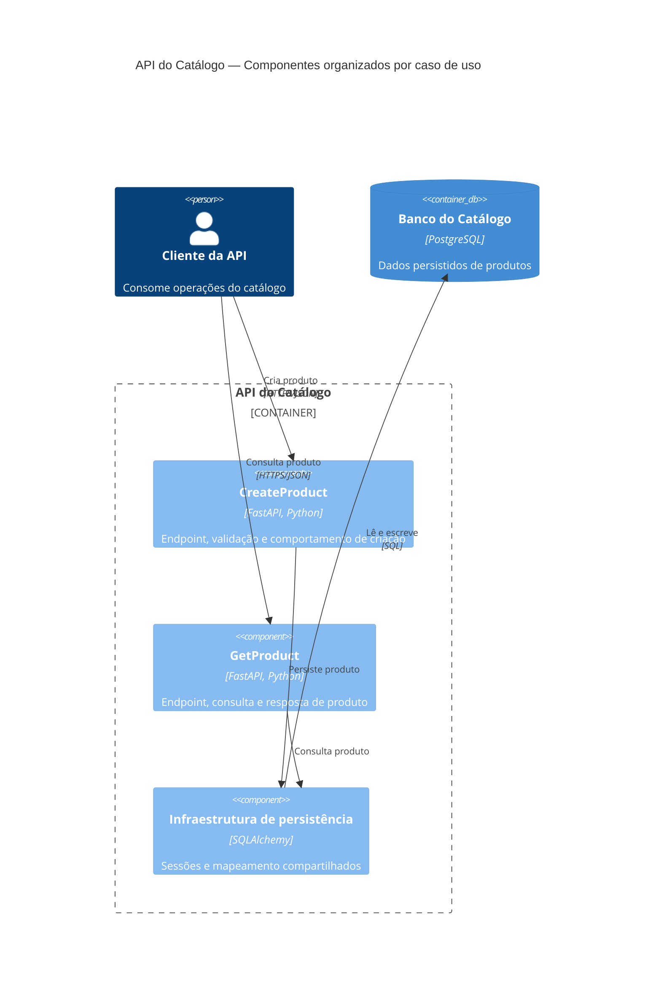

# Vertical Slice Architecture

Author: Gilmar Pupo
Canonical: https://www.bpstrat.com.br/docs/arquitetura-engenharia/organizacao-software/vertical-slice.html

---

# Vertical Slice Architecture
{: .no_toc }

## Índice
{: .no_toc .text-delta }

1. TOC
{:toc}

Em uma aplicação organizada por camadas técnicas, uma mudança como “criar produto” pode exigir alterações em controller, service, repository, modelos e testes localizados em diretórios diferentes. Vertical Slice Architecture propõe outro eixo: manter próximas as partes que mudam para atender ao mesmo caso de uso.

Uma slice pode reunir entrada, validação, regra de aplicação, acesso a dados e resposta de uma operação. Isso não significa que todo código precise ser duplicado nem que cada slice tenha banco, processo ou deploy próprios. Infraestrutura, modelos realmente compartilhados e integrações podem continuar comuns quando esse compartilhamento é intencional.

A decisão central é organizar primeiro pelo comportamento entregue, e não pelo tipo técnico do arquivo. Na formulação de Jimmy Bogard, cada requisição é tratada como um caso de uso distinto, com acoplamento maior dentro da slice e menor entre slices.


A imagem ilustra que operações diferentes podem precisar de componentes diferentes. Ela não implica que cada caso de uso deva possuir banco ou infraestrutura exclusivos.

## O que Vertical Slice define

Vertical Slice define principalmente uma estratégia de organização:

- a unidade principal é um caso de uso ou uma requisição;
- o código que muda junto tende a permanecer próximo;
- cada slice pode usar a implementação proporcional ao seu problema;
- compartilhamentos são decisões explícitas, não uma obrigação arquitetural.

Não existe uma estrutura de pastas única. Uma operação simples pode caber em um arquivo; uma operação complexa pode precisar de vários arquivos internos. O limite útil é aquele que permite compreender e alterar o comportamento sem percorrer abstrações que não participam da decisão.

## O que não faz parte da definição

Vertical Slice pode ser combinada com outros padrões, mas não os exige.

### CQRS

CQRS separa as responsabilidades e os modelos de leitura e escrita. Essa separação pode ajudar quando consultas e comandos possuem requisitos diferentes de desempenho, segurança, escala ou modelagem. Também acrescenta estruturas, contratos e, em implementações com data stores distintos, sincronização e consistência eventual.

Nomear classes como `Command` e `Query` não demonstra, sozinho, que o sistema precisa de CQRS. Para CRUD simples, usar o mesmo modelo e a mesma persistência pode ter menor custo.

### Mediator

Um Mediator recebe uma mensagem e localiza o handler correspondente. Ele pode ser útil quando diferentes entradas despacham as mesmas operações ou quando o sistema precisa aplicar comportamentos transversais de forma consistente.

O custo é a indireção: o fluxo deixa de estar visível apenas pela chamada entre endpoint e handler. Em uma API pequena, a injeção direta do handler pode ser mais simples. Usar Mediator não garante baixo acoplamento entre dados, transações ou regras compartilhadas.

### Microservices e eventos

Slices são fronteiras de código. Microservices são fronteiras de execução e operação. Uma slice não se transforma automaticamente em serviço, tópico ou unidade de deploy, e um evento interno não se transforma automaticamente em contrato de integração.

## Exemplo em FastAPI

O cenário a seguir é didático. Ele usa Python 3.11, FastAPI, Pydantic 2, SQLAlchemy 2 e SQLite para manter o exemplo curto. Em produção, a criação do schema deveria ser substituída por migrações, e a configuração do banco deveria vir do ambiente.

### Estrutura

```text
projeto/
├── app/
│   ├── __init__.py
│   ├── main.py
│   ├── infrastructure/
│   │   ├── __init__.py
│   │   └── database.py
│   └── features/
│       ├── __init__.py
│       └── products/
│           ├── __init__.py
│           ├── create_product.py
│           └── get_product.py
└── pyproject.toml
```

`products` agrupa operações do mesmo assunto. As slices são `create_product` e `get_product`: cada arquivo contém o contrato HTTP e o comportamento da sua operação. O modelo de persistência permanece compartilhado porque ambas manipulam a mesma tabela.

### Infraestrutura compartilhada

```python
# app/infrastructure/database.py
from collections.abc import Generator

from sqlalchemy import String, create_engine
from sqlalchemy.orm import DeclarativeBase, Mapped, Session, mapped_column


class Base(DeclarativeBase):
    pass


class Product(Base):
    __tablename__ = "product"

    id: Mapped[int] = mapped_column(primary_key=True)
    name: Mapped[str] = mapped_column(String(120))


engine = create_engine(
    "sqlite:///catalog.db",
    connect_args={"check_same_thread": False},
)
Base.metadata.create_all(engine)


def get_session() -> Generator[Session, None, None]:
    with Session(engine) as session:
        yield session
```

O uso de `create_all()` serve apenas ao exemplo. Uma aplicação que precise evoluir dados ou preservar histórico de mudanças deve usar migrações versionadas.

### Slice `CreateProduct`

```python
# app/features/products/create_product.py
from typing import Annotated

from fastapi import APIRouter, Depends, status
from pydantic import BaseModel, ConfigDict, Field
from sqlalchemy.orm import Session

from app.infrastructure.database import Product, get_session


router = APIRouter(prefix="/products", tags=["products"])
SessionDependency = Annotated[Session, Depends(get_session)]


class CreateProductRequest(BaseModel):
    name: str = Field(min_length=1, max_length=120)


class ProductResponse(BaseModel):
    model_config = ConfigDict(from_attributes=True)

    id: int
    name: str


def handle_create_product(
    request: CreateProductRequest,
    session: Session,
) -> Product:
    product = Product(name=request.name)
    try:
        session.add(product)
        session.commit()
        session.refresh(product)
    except Exception:
        session.rollback()
        raise
    return product


@router.post(
    "",
    response_model=ProductResponse,
    status_code=status.HTTP_201_CREATED,
)
def create_product(
    request: CreateProductRequest,
    session: SessionDependency,
) -> Product:
    return handle_create_product(request, session)
```

Endpoint, validação, resposta e comportamento de criação estão próximos. O acesso transacional continua visível; não há Mediator porque o exemplo possui apenas uma entrada e uma chamada direta é suficiente.

### Slice `GetProduct`

```python
# app/features/products/get_product.py
from typing import Annotated

from fastapi import APIRouter, Depends, HTTPException, status
from pydantic import BaseModel, ConfigDict
from sqlalchemy.orm import Session

from app.infrastructure.database import Product, get_session


router = APIRouter(prefix="/products", tags=["products"])
SessionDependency = Annotated[Session, Depends(get_session)]


class ProductResponse(BaseModel):
    model_config = ConfigDict(from_attributes=True)

    id: int
    name: str


def handle_get_product(product_id: int, session: Session) -> Product:
    product = session.get(Product, product_id)
    if product is None:
        raise HTTPException(
            status_code=status.HTTP_404_NOT_FOUND,
            detail="Product not found",
        )
    return product


@router.get("/{product_id}", response_model=ProductResponse)
def get_product(
    product_id: int,
    session: SessionDependency,
) -> Product:
    return handle_get_product(product_id, session)
```

O contrato `ProductResponse` aparece nas duas slices para que cada operação permaneça explícita. Se esses contratos precisarem evoluir juntos e a repetição começar a produzir divergência, extrair um contrato compartilhado passa a ser uma decisão justificável.

### Composição da aplicação

```python
# app/main.py
from fastapi import FastAPI

from app.features.products.create_product import (
    router as create_product_router,
)
from app.features.products.get_product import (
    router as get_product_router,
)


app = FastAPI(title="Product Catalog")
app.include_router(create_product_router)
app.include_router(get_product_router)
```

O exemplo separa uma operação que altera estado de outra que apenas consulta, mas não implementa modelos ou data stores independentes. Adotar CQRS completo exigiria um problema que justificasse essa separação adicional.

Com as dependências instaladas, a aplicação pode ser iniciada com:

```bash
python -m uvicorn app.main:app --reload
```

As duas slices podem ser verificadas em sequência:

```bash
curl -X POST http://127.0.0.1:8000/products \
  -H 'Content-Type: application/json' \
  -d '{"name":"Keyboard"}'

curl http://127.0.0.1:8000/products/1
```

No banco vazio do exemplo, a primeira resposta deve conter `{"id":1,"name":"Keyboard"}` e a segunda deve recuperar o mesmo produto. Esse teste demonstra o fluxo básico; ele não cobre concorrência, falha de banco, autenticação ou migração.

## Fluxo de uma slice

No exemplo de criação:

1. o endpoint recebe e valida o corpo HTTP;
2. `handle_create_product` executa o comportamento da operação;
3. a sessão SQLAlchemy delimita a transação;
4. o resultado é serializado pelo contrato de resposta.

Um Mediator poderia ser inserido entre os passos 1 e 2. Isso mudaria o mecanismo de despacho, não a definição da slice.

## Diagrama de componentes

O diagrama amplia apenas o container da API. As slices e a infraestrutura de persistência são componentes internos; PostgreSQL aparece como container de apoio. No exemplo executável foi usado SQLite, mas PostgreSQL representa uma possível configuração de produção, não uma exigência de Vertical Slice.



Se um Mediator fosse adotado, ele seria outro componente dentro da fronteira da API. Só deveria aparecer como container se fosse uma aplicação ou um data store separado.

## Comparação com organização por camadas

As duas abordagens podem ser implementadas com qualidade. A diferença abaixo descreve o eixo de organização, não uma garantia de resultado.

| Critério | Organização por camadas | Organização por slices |
|---|---|---|
| Unidade principal | Responsabilidade técnica | Caso de uso ou requisição |
| Mudança típica | Percorre diretórios de controller, service e repository | Concentra contratos e comportamento na slice |
| Compartilhamento | Frequentemente centralizado por tipo técnico | Extraído quando mais de uma slice precisa dele |
| Risco recorrente | Abstrações globais e mudanças transversais | Duplicação, divergência e slices com limites ruins |
| Estratégia de teste | Componentes e integrações entre camadas | Comportamento da slice e integrações utilizadas |

A arquitetura em camadas pode preservar módulos de domínio e limitar mudanças. Vertical Slice também pode acumular dependências globais. A estrutura de pastas apenas torna algumas escolhas mais visíveis; ela não substitui revisão, testes ou desenho de limites.

## Benefícios possíveis

Quando as slices correspondem a casos de uso estáveis e o compartilhamento é controlado, a abordagem pode:

- aproximar contratos, regras e testes que mudam juntos;
- permitir implementações diferentes para operações com necessidades diferentes;
- reduzir alterações em abstrações globais;
- tornar explícito quais dependências cada operação usa.

Esses benefícios precisam ser verificados no código e no fluxo da equipe. Um banco compartilhado, regras transversais ou contratos comuns ainda podem fazer uma mudança afetar várias slices.

## Custos e modos de falha

- **Duplicação prematura ou excessiva:** validações e mapeamentos podem divergir.
- **Slices amplas demais:** uma pasta como `product` pode virar uma aplicação em camadas em miniatura.
- **Slices pequenas demais:** fragmentação pode dificultar a leitura de uma única regra de negócio.
- **Compartilhamento sem dono:** utilitários comuns podem recriar uma camada global acoplada.
- **Regras entre operações:** invariantes que atravessam casos de uso exigem coordenação e testes de integração.
- **Indireção:** Mediator, behaviors e registro dinâmico podem dificultar navegação e depuração.
- **CQRS sem necessidade:** modelos duplicados e sincronização podem custar mais do que a assimetria de leitura e escrita justifica.
- **Dependência de convenções:** a linguagem ou o framework podem não impedir referências indevidas entre slices.

## Quando considerar a abordagem

Vertical Slice merece consideração quando:

- mudanças de um caso de uso atravessam repetidamente muitas pastas técnicas;
- operações diferentes precisam de modelos ou estratégias de persistência diferentes;
- a equipe consegue reconhecer duplicação, extrair compartilhamentos e revisar limites;
- testes podem validar o comportamento de cada operação e suas integrações.

Uma estrutura mais simples tende a ser proporcional quando o sistema é um CRUD pequeno, quando as operações compartilham quase toda a implementação ou quando a equipe ainda não possui critérios para manter os limites.

## Limite operacional: slice não é unidade de deploy

No exemplo, todas as slices executam na mesma API e usam o mesmo banco. Isso forma uma unidade de deploy e, normalmente, uma unidade de escala. A aplicação ainda pode ter várias réplicas; o que ela não consegue fazer é dimensionar ou publicar apenas `CreateProduct` sem separar sua fronteira de execução.

Separar uma parte do sistema pode fazer sentido quando existem evidências como:

- carga sustentada que exige escala independente;
- ownership e ciclos de mudança realmente distintos;
- necessidade de isolamento de falhas;
- requisitos de segurança ou dados incompatíveis com o compartilhamento atual;
- deploy conjunto causando impacto operacional mensurável.

Essa separação também introduz contratos versionados, rede, autenticação entre serviços, observabilidade distribuída, retries, idempotência e decisões de consistência. Organização por slices pode facilitar a identificação de uma fronteira, mas não comprova que a fronteira esteja pronta para distribuição.

Vertical Slice também não substitui Bounded Context. Uma slice descreve um comportamento; um Bounded Context delimita onde um modelo e sua linguagem são válidos. Antes de extrair uma slice como serviço, é necessário verificar dados, invariantes, integrações e responsabilidade operacional.

## Critérios para CQRS, Mediator e distribuição

| Decisão | Sinal favorável | Custo a observar |
|---|---|---|
| CQRS | Leituras e escritas precisam de modelos, segurança ou escala diferentes | Modelos duplicados, sincronização e consistência |
| Mediator | Várias entradas despacham mensagens e behaviors transversais precisam de aplicação uniforme | Indireção, registro e depuração |
| Deploy separado | Escala, ownership, risco ou disponibilidade exigem fronteira operacional própria | Rede, contratos, operação e falhas distribuídas |

Essas decisões devem responder a um problema observado. Elas não são etapas obrigatórias de maturidade de uma Vertical Slice Architecture.

## Referências

- [Jimmy Bogard: Vertical Slice Architecture](https://www.jimmybogard.com/vertical-slice-architecture/)
- [Microsoft: padrão CQRS](https://learn.microsoft.com/en-us/azure/architecture/patterns/cqrs)
- [C4 Model: diagrama de containers](https://c4model.com/diagrams/container)
- [C4 Model: diagrama de componentes](https://c4model.com/diagrams/component)
- [Martin Fowler: Monolith First](https://martinfowler.com/bliki/MonolithFirst.html)
- [FastAPI: Bigger Applications](https://fastapi.tiangolo.com/tutorial/bigger-applications/)
- [SQLAlchemy 2: Session Basics](https://docs.sqlalchemy.org/en/20/orm/session_basics.html)
