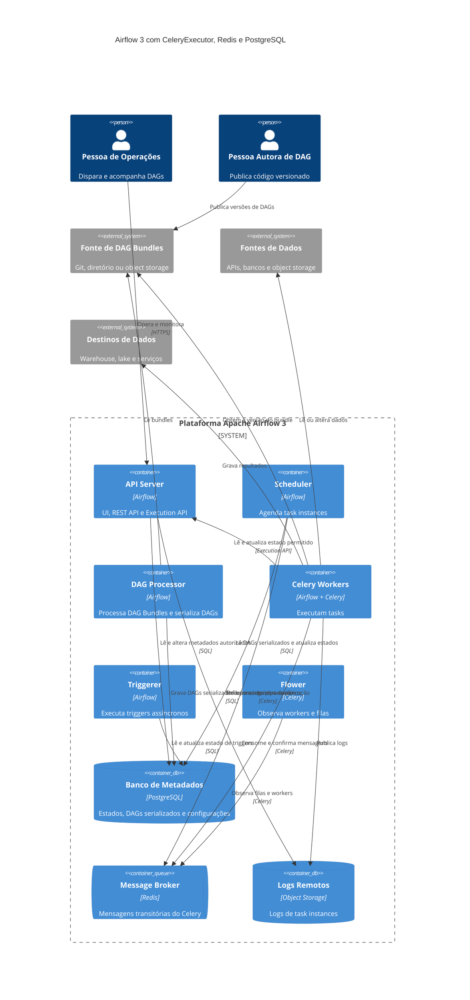

# Diagrama de Container

Author: Gilmar Pupo
Canonical: https://www.bpstrat.com.br/docs/data-engineering/apache-airflow/apache-airflow-diagrama-de-container-c4-n%C3%ADvel-2.html

---

# Apache Airflow 3: Diagrama de Container C4
{: .no_toc }

## Índice
{: .no_toc .text-delta }

1. TOC
{:toc}

{: .rounded }

Um diagrama de containers do Airflow só é útil quando declara a topologia. Redis,
Celery Workers e Flower, por exemplo, pertencem a uma implantação com
CeleryExecutor; não são componentes obrigatórios de todo Airflow.

O modelo abaixo considera:

- Apache Airflow 3;
- CeleryExecutor;
- Redis como broker;
- PostgreSQL como banco de metadados;
- DAG Bundles acessíveis ao DAG Processor e aos workers;
- armazenamento remoto de logs;
- uso de Operators deferrable.

Trocar o executor, o broker ou o backend de logs exige atualizar o diagrama.

## Componentes e limites

| Container | Responsabilidade | Condição |
|-----------|------------------|----------|
| API Server | serve UI, APIs e a Execution API usada pelas tasks | necessário |
| Scheduler | cria e agenda task instances por meio do executor | necessário |
| DAG Processor | lê DAG Bundles, executa parsing e serializa DAGs | necessário no Airflow 3 |
| Celery Worker | executa as tasks enfileiradas | específico do CeleryExecutor |
| Triggerer | executa triggers assíncronos de tasks deferrable | necessário quando há deferral |
| PostgreSQL | persiste estados, configurações e metadados | backend externo adotado neste modelo |
| Redis | transporta mensagens transitórias do Celery | broker adotado neste modelo |
| Flower | observa workers e filas Celery | opcional |
| Object Storage | persiste logs remotos | escolha operacional deste modelo |

O banco de metadados não deve ser descrito como armazenamento dos arquivos de
log. Ele mantém estados e referências; logs de tasks ficam em arquivos locais ou
em um backend remoto configurado.

No Airflow 3, código executado por uma task não deve acessar diretamente o banco
de metadados. Workers usam a Execution API para operações permitidas. O diagrama
representa essa fronteira com uma relação entre Worker e API Server.

## Diagrama C4



## Como ler o fluxo

1. A pessoa autora publica uma versão do DAG Bundle.
2. O DAG Processor lê o bundle, processa os arquivos e grava a representação
   serializada no metastore.
3. O Scheduler avalia agenda e dependências e pede ao CeleryExecutor que
   enfileire a task no broker.
4. Um Celery Worker consome a mensagem, obtém a versão do bundle e executa a
   task.
5. A task usa a Execution API para interações autorizadas com o Airflow e acessa
   fontes ou destinos externos conforme sua implementação.
6. Logs são enviados ao backend remoto; estado e referências permanecem no
   metastore.

Tasks deferrable deixam o worker durante a espera e transferem essa etapa para o
Triggerer. Quando o trigger dispara, a task volta a ser agendada para concluir em
um worker.

## O que o diagrama não demonstra

O desenho não garante alta disponibilidade, segurança ou capacidade. Ele também
não mostra réplicas, balanceadores, TLS, secrets backends, backups, pools,
limites de rede e topologias de falha.

Antes de usá-lo como arquitetura de produção, registre:

- número de instâncias e domínio de falha de cada componente;
- RTO e RPO do metastore, broker, bundles e logs;
- quais componentes recebem cada segredo;
- capacidade dos workers, scheduler e triggerer;
- política de atualização e compatibilidade de schema;
- comportamento quando broker, banco ou object storage fica indisponível.

## Filesystem em Docker Compose

Uma implantação local baseada no `LocalDagBundle` pode usar esta estrutura:

```text
meu-projeto-airflow/
├── config/
│   └── airflow.cfg
├── dags/
│   ├── etl_clientes.py
│   └── relatorio_diario.py
├── logs/
├── plugins/
└── docker-compose.yaml
```

- `dags/`: fonte do `LocalDagBundle`; esse backend não oferece versionamento de
  bundle, portanto tasks usam os arquivos disponíveis no momento da execução;
- `logs/`: destino local quando remote logging não está configurado;
- `config/airflow.cfg`: uma possível fonte de configuração, complementada ou
  substituída por variáveis de ambiente;
- `plugins/`: código carregado pelo mecanismo de plugins quando essa extensão é
  realmente necessária;
- `docker-compose.yaml`: serviços, redes, volumes e configurações do ambiente
  local.

Em produção, DAG Bundles, logs e configurações podem não corresponder a pastas
compartilhadas. O filesystem do Compose é um exemplo de desenvolvimento, não um
requisito arquitetural do Airflow.

## Fonte PlantUML equivalente

```plantuml
@startuml
!includeurl https://raw.githubusercontent.com/plantuml-stdlib/C4-PlantUML/master/C4_Container.puml

title Airflow 3 com CeleryExecutor, Redis e PostgreSQL

Person(operations_user, "Pessoa de Operações", "Dispara e acompanha DAGs")
System_Ext(dag_bundle, "Fonte de DAG Bundles", "Git, diretório ou object storage")
System_Ext(data_systems, "Sistemas de Dados", "Fontes e destinos")

System_Boundary(airflow, "Plataforma Apache Airflow 3") {
    Container(api_server, "API Server", "Airflow", "UI, REST e Execution API")
    Container(scheduler, "Scheduler", "Airflow", "Agenda task instances")
    Container(dag_processor, "DAG Processor", "Airflow", "Processa DAG Bundles")
    Container(worker, "Celery Workers", "Airflow + Celery", "Executam tasks")
    Container(triggerer, "Triggerer", "Airflow", "Executa triggers")
    Container(flower, "Flower", "Celery", "Observa workers e filas")
    ContainerDb(metastore, "Banco de Metadados", "PostgreSQL", "Estados e configurações")
    ContainerQueue(broker, "Message Broker", "Redis", "Mensagens transitórias")
    ContainerDb(logs, "Logs Remotos", "Object Storage", "Logs de tasks")
}

Rel(operations_user, api_server, "Opera", "HTTPS")
Rel(dag_processor, dag_bundle, "Lê bundles")
Rel(dag_processor, metastore, "Serializa DAGs", "SQL")
Rel(scheduler, metastore, "Lê e atualiza estados", "SQL")
Rel(scheduler, broker, "Enfileira tasks", "Celery")
Rel(worker, broker, "Consome tasks", "Celery")
Rel(worker, dag_bundle, "Obtém bundle")
Rel(worker, api_server, "Usa Execution API", "HTTPS")
Rel(worker, data_systems, "Executa operações")
Rel(worker, logs, "Publica logs")
Rel(api_server, metastore, "Opera metadados", "SQL")
Rel(triggerer, metastore, "Opera triggers", "SQL")
Rel(flower, broker, "Observa Celery")

SHOW_LEGEND()
@enduml
```

## Referências

APACHE AIRFLOW. *Architecture Overview*. Disponível em:
[https://airflow.apache.org/docs/apache-airflow/stable/core-concepts/overview.html](https://airflow.apache.org/docs/apache-airflow/stable/core-concepts/overview.html)

APACHE AIRFLOW. *Public Interface for Airflow 3.0+*. Disponível em:
[https://airflow.apache.org/docs/apache-airflow/stable/public-airflow-interface.html](https://airflow.apache.org/docs/apache-airflow/stable/public-airflow-interface.html)

APACHE AIRFLOW. *Dag Bundles*. Disponível em:
[https://airflow.apache.org/docs/apache-airflow/stable/administration-and-deployment/dag-bundles.html](https://airflow.apache.org/docs/apache-airflow/stable/administration-and-deployment/dag-bundles.html)

APACHE AIRFLOW PROVIDERS CELERY. *Celery Executor*. Disponível em:
[https://airflow.apache.org/docs/apache-airflow-providers-celery/stable/celery_executor.html](https://airflow.apache.org/docs/apache-airflow-providers-celery/stable/celery_executor.html)

APACHE AIRFLOW. *Logging for Tasks*. Disponível em:
[https://airflow.apache.org/docs/apache-airflow/stable/administration-and-deployment/logging-monitoring/logging-tasks.html](https://airflow.apache.org/docs/apache-airflow/stable/administration-and-deployment/logging-monitoring/logging-tasks.html)
