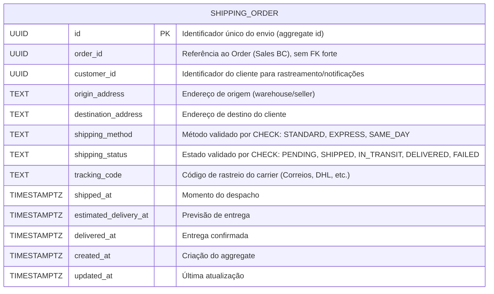
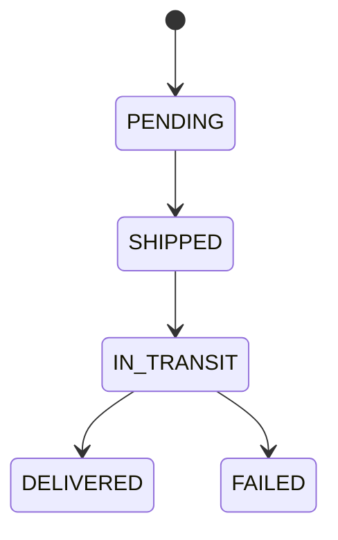
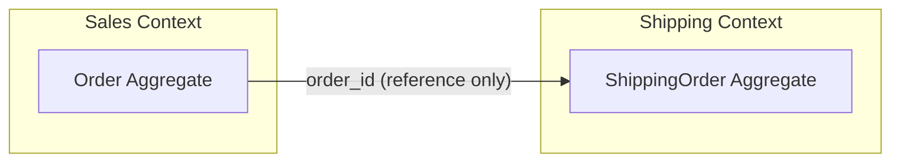
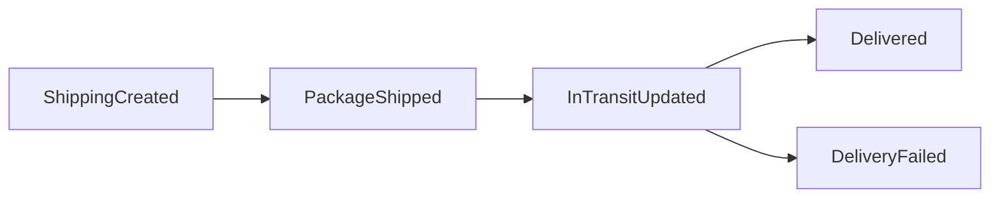

# Modelagem por exemplo

Author: Gilmar Pupo
Canonical: https://www.bpstrat.com.br/docs/ddd/ddd-modeling-shipping-postgresql.html

---

# Modelagem de Domínio Shipping em PostgreSQL (DDD)
{: .no_toc }


## Índice
{: .no_toc .text-delta }

1. TOC
{:toc}

Apresentamos um exemplo de modelagem de domínio para `Shipping`, aplicando princípios de [DDD](/docs/ddd/) diretamente no esquema de banco de dados. O objetivo é tornar o modelo explícito, utilizando uma linguagem ubíqua consistente entre código, dados e comunicação entre times.

A abordagem prioriza nomes semânticos, descrições via `COMMENT ON` e uma representação explícita do ciclo de vida do envio. Esses elementos oferecem contexto para quem mantém o sistema, mas não substituem constraints, código de domínio ou testes.

A modelagem é estruturada para refletir bounded contexts. Neste exemplo, referências a outros contextos não usam foreign keys; essa é uma decisão de integração, não uma exigência de DDD, e transfere a validação dessas referências para a aplicação ou para outro mecanismo.

O resultado é um schema que persiste dados e documenta parte das regras do domínio. Ele pode oferecer contexto para desenvolvedores e ferramentas automatizadas, mas o estado atual de uma linha não preserva sozinho o histórico das transições nem dos eventos publicados.


## Importância da Modelagem Explícita
- Melhora a compreensão humana durante o onboarding e a manutenção do sistema.
- Oferece contexto explícito para ferramentas automatizadas por meio de nomes, descrições e constraints; a utilidade desse contexto precisa ser avaliada no fluxo em que será usado.
- Utiliza o vocabulário do domínio (Ubiquitous Language) diretamente no esquema do banco de dados.

### Estrutura da Tabela de Domínio (DDL)

```sql

CREATE TABLE shipping_order (
    id UUID PRIMARY KEY,
    order_id UUID NOT NULL,
    customer_id UUID NOT NULL,

    origin_address TEXT NOT NULL,
    destination_address TEXT NOT NULL,

    shipping_method TEXT NOT NULL
        CONSTRAINT shipping_order_method_check
        CHECK (shipping_method IN ('STANDARD', 'EXPRESS', 'SAME_DAY')),
    shipping_status TEXT NOT NULL
        CONSTRAINT shipping_order_status_check
        CHECK (
            shipping_status IN (
                'PENDING',
                'SHIPPED',
                'IN_TRANSIT',
                'DELIVERED',
                'FAILED'
            )
        ),

    tracking_code TEXT,

    shipped_at TIMESTAMPTZ,
    estimated_delivery_at TIMESTAMPTZ,
    delivered_at TIMESTAMPTZ,

    created_at TIMESTAMPTZ NOT NULL DEFAULT CURRENT_TIMESTAMP,
    updated_at TIMESTAMPTZ NOT NULL DEFAULT CURRENT_TIMESTAMP,

    CONSTRAINT shipping_order_state_check CHECK (
        (
            shipping_status = 'PENDING'
            AND shipped_at IS NULL
            AND delivered_at IS NULL
        )
        OR
        (
            shipping_status IN ('SHIPPED', 'IN_TRANSIT', 'FAILED')
            AND shipped_at IS NOT NULL
            AND tracking_code IS NOT NULL
            AND delivered_at IS NULL
        )
        OR
        (
            shipping_status = 'DELIVERED'
            AND shipped_at IS NOT NULL
            AND tracking_code IS NOT NULL
            AND delivered_at IS NOT NULL
        )
    )
);

CREATE FUNCTION set_shipping_order_updated_at()
RETURNS TRIGGER
LANGUAGE plpgsql
AS $$
BEGIN
    NEW.updated_at = CURRENT_TIMESTAMP;
    RETURN NEW;
END;
$$;

CREATE TRIGGER shipping_order_set_updated_at
BEFORE UPDATE ON shipping_order
FOR EACH ROW
EXECUTE FUNCTION set_shipping_order_updated_at();


COMMENT ON TABLE shipping_order IS
'Aggregate root do contexto de Shipping. Representa o estado atual do processo de envio associado a um pedido, incluindo origem, destino, método e ciclo de vida de entrega.';

COMMENT ON COLUMN shipping_order.id IS
'Identificador único do envio (aggregate id).';

COMMENT ON COLUMN shipping_order.order_id IS
'Referência ao pedido (Order) no contexto de Sales. Neste exemplo, a integridade da referência é validada fora deste schema.';

COMMENT ON COLUMN shipping_order.customer_id IS
'Identificador do cliente associado ao envio. Usado para rastreamento e notificações.';

COMMENT ON COLUMN shipping_order.origin_address IS
'Endereço de origem do envio. Normalmente um warehouse ou seller.';

COMMENT ON COLUMN shipping_order.destination_address IS
'Endereço de destino final do cliente.';

COMMENT ON COLUMN shipping_order.shipping_method IS
'Método de envio escolhido. Enum conceitual do domínio (ex: STANDARD, EXPRESS, SAME_DAY).';

COMMENT ON COLUMN shipping_order.shipping_status IS
'Estado atual do envio dentro do lifecycle: PENDING -> SHIPPED -> IN_TRANSIT -> DELIVERED ou FAILED.';

COMMENT ON COLUMN shipping_order.tracking_code IS
'Código de rastreio fornecido pelo carrier externo (ex: Correios, DHL).';

COMMENT ON COLUMN shipping_order.shipped_at IS
'Timestamp em que o pacote foi despachado.';

COMMENT ON COLUMN shipping_order.estimated_delivery_at IS
'Previsão de entrega baseada no método e carrier.';

COMMENT ON COLUMN shipping_order.delivered_at IS
'Timestamp efetivo de entrega confirmada.';

COMMENT ON COLUMN shipping_order.created_at IS
'Timestamp de criação do registro.';

COMMENT ON COLUMN shipping_order.updated_at IS
'Instante da última atualização da linha, mantido pelo trigger shipping_order_set_updated_at.';

COMMENT ON CONSTRAINT shipping_order_state_check ON shipping_order IS
'Valida combinações permitidas entre o estado atual, os instantes do envio e o código de rastreio. Não valida a ordem histórica das transições.';

```

### O que o banco garante neste exemplo

Os `CHECK` constraints rejeitam métodos e estados desconhecidos e validam as combinações de valores da linha atual. Por exemplo, um envio marcado como `DELIVERED` precisa ter `shipped_at`, `tracking_code` e `delivered_at`.

Essa validação não comprova que a transição anterior foi válida. Um `CHECK` não compara, por si só, o estado anterior com o novo estado. A sequência `PENDING → SHIPPED → IN_TRANSIT`, portanto, precisa ser controlada pelo aggregate na aplicação ou por um trigger específico que examine `OLD` e `NEW`.

O trigger incluído no exemplo tem uma responsabilidade mais simples: atualizar `updated_at` sempre que a linha for modificada. Os campos temporais usam `TIMESTAMPTZ` porque representam instantes operacionais que podem ser produzidos e consultados em fusos diferentes.


Práticas que ajudam modelos:

- nomes explícitos (`shipping_status` > `status`)
- descrições com **vocabulário de domínio**
- lifecycle descrito no comentário
- exemplos no texto (STANDARD, EXPRESS)

## Diagrama Mermaid — Shipping (DDD)

### Estrutura da tabela (ER simplificado)



---

### Ciclo de vida do envio



O diagrama representa a sequência de transições assumida pelo exemplo. O `CHECK` do banco valida o estado resultante, mas não impõe essa ordem histórica.

---

### Contexto DDD (Bounded Contexts)



---

### Eventos de domínio



Esses nomes representam eventos que a aplicação pode publicar ao executar as transições. Eles não podem ser reconstruídos de forma confiável apenas a partir de `shipping_status`: o estado atual não registra quando cada transição ocorreu, quantas tentativas existiram ou se a publicação foi concluída. Quando esse histórico for necessário, uma tabela de eventos, um log de transições ou um mecanismo de outbox deve ser modelado explicitamente.

---


* `SHIPPING_ORDER` é o aggregate root no contexto de Shipping
* `order_id` é referência externa (sem FK forte)
* constraints validam uma parte das invariantes do estado atual
* a aplicação ou um trigger específico controla a ordem das transições
* eventos e histórico precisam de persistência explícita quando forem requisitos


## Linguagem Ubíqua 

### Termos centrais (Aggregate e entidades)

- **ShippingOrder**  
    Aggregate root que representa um envio associado a um pedido. Controla o lifecycle e as invariantes do processo de entrega.
- **OrderId**  
    Identificador do pedido no contexto de Sales. Referência externa (sem FK forte).
- **CustomerId**  
    Identificador do cliente. Usado para rastreamento e comunicação.
- **Address**  
    Valor (Value Object) que representa origem ou destino do envio.

---

### Value Objects

- **OriginAddress**  
    Endereço de origem (warehouse/seller).
- **DestinationAddress**  
    Endereço de destino do cliente.
- **TrackingCode**  
    Código fornecido pelo carrier para rastreamento do pacote.

---

### Enumerações (conceitos fechados)

- **ShippingMethod**  
    Método de envio disponível.  
    Valores típicos: `STANDARD`, `EXPRESS`, `SAME_DAY`.
- **ShippingStatus**  
    Estado atual do envio no lifecycle.  
    Estados:
    - `PENDING` — criado, ainda não despachado
    - `SHIPPED` — enviado ao carrier
    - `IN_TRANSIT` — em transporte
    - `DELIVERED` — entregue com sucesso
    - `FAILED` — falha na entrega

---

### Ciclo de vida assumido pelo exemplo

- Transições válidas:
    - `PENDING → SHIPPED`
    - `SHIPPED → IN_TRANSIT`
    - `IN_TRANSIT → DELIVERED`
    - `IN_TRANSIT → FAILED`
- Invariantes do estado atual aplicadas pelo DDL:
    - `delivered_at` só pode existir se `shipping_status = DELIVERED`
    - `shipped_at` deve existir a partir de `SHIPPED`
    - `tracking_code` deve existir a partir de `SHIPPED`
- Regra aplicada pela aplicação ou por um trigger de transição:
    - o novo estado deve ser um sucessor permitido do estado anterior

---

### Eventos de domínio

- **ShippingCreated**  
    Disparado na criação do envio.
- **PackageShipped**  
    Indica que o pacote foi despachado.
- **InTransitUpdated**  
    Atualizações intermediárias de transporte.
- **Delivered**  
    Entrega concluída com sucesso.
- **DeliveryFailed**  
    Falha definitiva na entrega.

---

### Papéis externos (integrações)

- **Carrier**  
    Provedor logístico (ex: Correios, DHL). Responsável pelo transporte físico.

---

### Regras de modelagem (linguagem ubíqua)

- Usar sempre `ShippingOrder` (não “shipment”, “delivery”, etc. misturados)
- Usar `ShippingStatus`, não apenas `status`
- Diferenciar claramente `Order` (Sales) de `ShippingOrder` (Shipping)
- Preferir termos explícitos a abreviações

---

### Mapeamento para tabela (referência)

- `ShippingOrder.id` → `shipping_order.id`
- `ShippingStatus` → `shipping_order.shipping_status`
- `ShippingMethod` → `shipping_order.shipping_method`
- `TrackingCode` → `shipping_order.tracking_code`


Este exemplo assume **ShippingOrder** como aggregate root do contexto de Shipping, responsável por controlar o ciclo de vida do envio. O DDL protege as combinações de valores da linha atual; as transições continuam sob responsabilidade do aggregate na aplicação, a menos que um trigger específico seja adotado. Em cenários reais, esse aggregate pode evoluir para incluir outras entidades e value objects, como múltiplos pacotes, eventos de tracking detalhados e integrações com carriers.

O modelo apresentado é intencionalmente **simplificado** para fins didáticos. Ele foca na clareza da [linguagem ubíqua](/docs/ddd/o-dicionário-ubíquo-eliminando-a-ambiguidade.html) e na representação dos conceitos principais, sem cobrir todas as variações e complexidades comuns em sistemas de logística em produção.

Na prática, a modelagem deve ser refinada de acordo com as necessidades do domínio, volume de dados, integrações externas e requisitos operacionais.

## Referências

- [PostgreSQL: `CREATE TABLE` e constraints](https://www.postgresql.org/docs/current/sql-createtable.html)
- [PostgreSQL: comportamento de triggers](https://www.postgresql.org/docs/current/trigger-definition.html)
- [PostgreSQL: tipos de data e hora](https://www.postgresql.org/docs/current/datatype-datetime.html)
