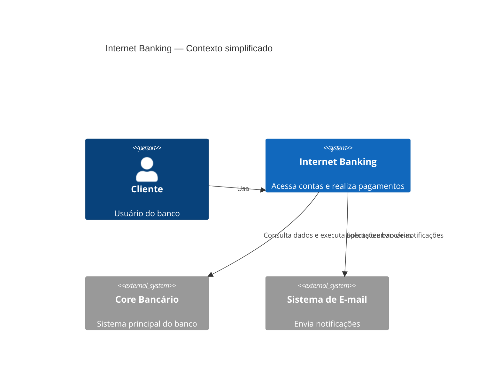
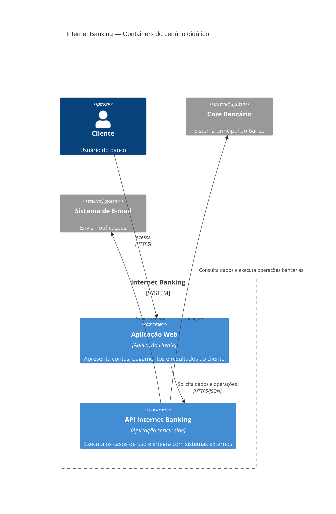

# Exemplo Internet Banking

Author: Gilmar Pupo
Canonical: https://www.bpstrat.com.br/docs/metodologia/c4model/internet-banking-c4-model.html

---

# Exemplo Internet Banking C4 Model
{: .no_toc }

## Índice
{: .no_toc .text-delta }

1. TOC
{:toc}

## Nível 1 — Diagrama de contexto

O primeiro diagrama mostra o Internet Banking como uma única unidade e identifica as pessoas e os sistemas externos com os quais ele se relaciona. Neste nível, ainda não são mostradas as aplicações internas.

## Nível 2 — Diagrama de containers

Para ampliar o sistema, este exemplo assume duas aplicações executadas separadamente: uma aplicação web usada pelo cliente e uma API responsável pelos casos de uso. Também assume acesso por HTTPS e comunicação HTTPS/JSON entre essas aplicações. O Core Bancário e o Sistema de E-mail continuam fora da fronteira do Internet Banking.

Essas aplicações são hipóteses didáticas. O exemplo não inclui banco próprio, filas ou frameworks específicos porque essas decisões não estão presentes no material de origem.

No modelo C4, um container representa uma aplicação ou um data store. Classes, módulos e serviços internos da API pertencem a um eventual diagrama de componentes, não a este nível.

## Limitações do exemplo

O diagrama não informa como autenticação, autorização, persistência local, auditoria, disponibilidade ou recuperação são implementadas. Essas decisões precisam ser adicionadas quando existirem requisitos ou evidências que as sustentem.

A sintaxe C4 do Mermaid ainda é marcada como experimental e pode mudar entre versões. O nível de abstração do diagrama deve permanecer o mesmo mesmo que a ferramenta de renderização seja substituída.

## Referências

- [C4 Model: diagrama de contexto](https://c4model.com/diagrams/system-context)
- [C4 Model: diagrama de containers](https://c4model.com/diagrams/container)
- [Mermaid: sintaxe para diagramas C4](https://mermaid.js.org/syntax/c4.html)
