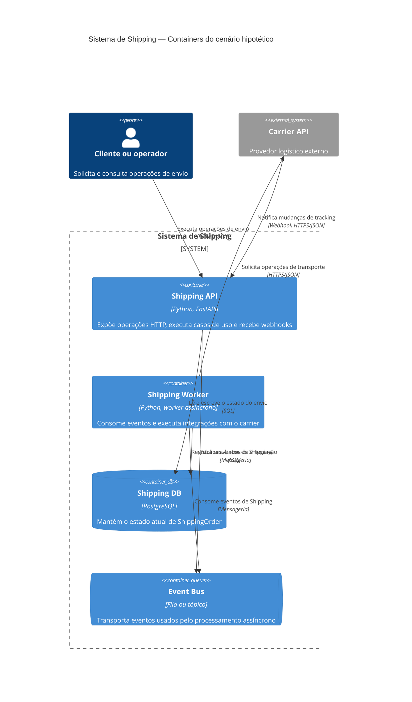
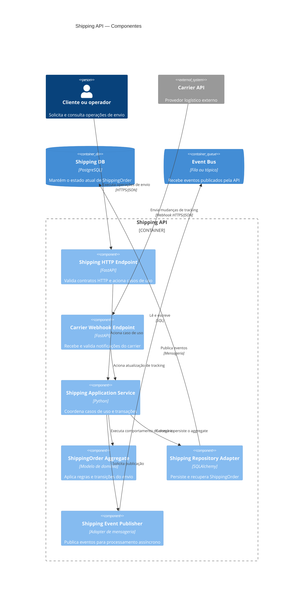
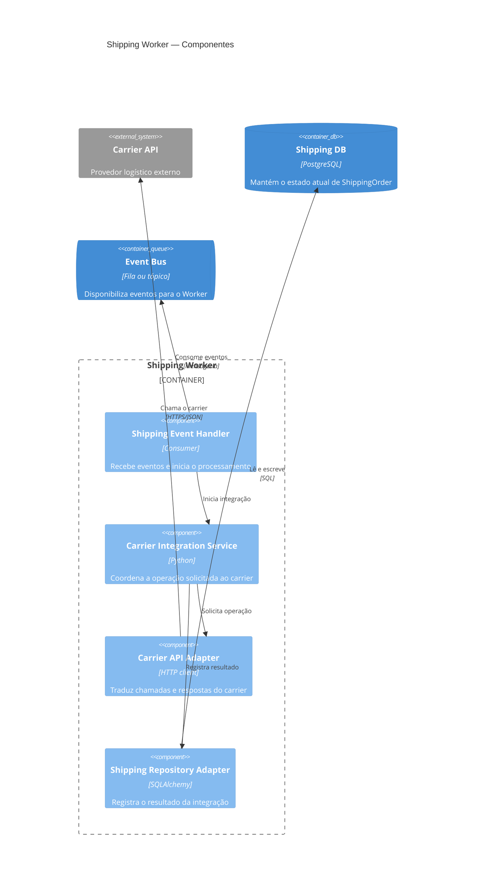

# Exemplo Shipping

Author: Gilmar Pupo
Canonical: https://www.bpstrat.com.br/docs/metodologia/c4model/shipping-c4-model.html

---

# Shipping no C4: containers e componentes
{: .no_toc }

## Índice
{: .no_toc .text-delta }

1. TOC
{:toc}

Esta página complementa o exemplo de [modelagem do domínio Shipping](/docs/ddd/ddd-modeling-shipping-postgresql.html) com uma visão de arquitetura no modelo C4. O objetivo é mostrar a progressão entre containers e componentes sem transformar camadas de código em unidades de execução.

Os diagramas representam um **cenário hipotético**, não uma arquitetura observada em produção. Tecnologias, protocolos e fronteiras foram escolhidos para tornar o exemplo concreto e precisam ser validados contra requisitos reais antes de orientar uma implementação.

## Hipóteses do cenário

Para este exemplo, assumimos quatro unidades operacionais dentro do sistema de Shipping:

- **Shipping API:** aplicação HTTP executada e publicada como uma unidade;
- **Shipping Worker:** aplicação assíncrona executada separadamente da API;
- **Shipping DB:** data store PostgreSQL compartilhado pela API e pelo Worker;
- **Event Bus:** fila ou tópico acessível pelas duas aplicações.

A Carrier API permanece um sistema externo. O cenário assume que o Worker solicita operações ao carrier e que o carrier envia mudanças de tracking para um webhook da Shipping API.

`Application Services`, `ShippingOrder Aggregate`, repositories e adapters não são containers neste cenário. Eles executam dentro da API ou do Worker e aparecem somente nos diagramas de componentes.

## Nível 2 — Containers

Um container no C4 representa uma aplicação ou um data store. O diagrama abaixo mostra unidades executáveis e seus relacionamentos; ele não mostra classes, módulos, réplicas ou nós de infraestrutura.

O Event Bus aparece dentro da fronteira porque o cenário o trata como parte do sistema de Shipping. Se a mensageria for uma plataforma externa administrada por outra equipe, sua fronteira e sua responsabilidade devem ser representadas de outra forma.

## Nível 3 — Componentes da Shipping API

Este diagrama amplia somente o container **Shipping API**. Shipping DB, Event Bus, usuário e Carrier API aparecem como elementos de apoio porque se relacionam diretamente com componentes da API.

O diagrama mostra responsabilidades, não a ordem temporal de uma requisição. Se a sequência entre persistir o aggregate e publicar o evento for relevante, um diagrama dinâmico e a estratégia de consistência devem complementar esta visão.

## Nível 3 — Componentes do Shipping Worker

O segundo diagrama amplia somente o container **Shipping Worker**. Mesmo que API e Worker compartilhem bibliotecas no código-fonte, eles continuam sendo aplicações distintas no cenário porque possuem processos e ciclos de execução próprios.

O exemplo não determina se regras de domínio são compartilhadas como biblioteca, reimplementadas ou chamadas por outro contrato. Essa decisão precisa preservar as invariantes de `ShippingOrder` e evitar que o Worker faça atualizações incompatíveis com a API.

## O que os diagramas não garantem

Os relacionamentos mostram dependências, mas não demonstram propriedades operacionais. Antes de usar esta topologia em produção, ainda seria necessário decidir e testar:

- consistência entre a transação no PostgreSQL e a publicação no Event Bus;
- idempotência, retries, ordenação, dead-letter queue e tratamento de mensagens duplicadas;
- autenticação do webhook e proteção contra replay;
- permissões distintas para API e Worker no banco e na mensageria;
- timeouts, circuit breaking e limites de chamadas ao carrier;
- observabilidade e correlação entre requisição, evento e integração;
- recuperação quando banco, broker ou carrier estiverem indisponíveis.

O banco compartilhado simplifica algumas transações, mas também acopla API e Worker ao mesmo schema e ao mesmo ciclo de migração. Separá-lo só seria justificável diante de requisitos de ownership, escala, segurança ou disponibilidade que compensassem o custo de sincronização.

Réplicas, clusters, zonas, processos e infraestrutura pertencem a um diagrama de deployment. Eles não devem ser inferidos a partir destes diagramas de containers e componentes.

## Como adaptar o exemplo

Ao documentar uma arquitetura real:

1. confirme quais elementos são aplicações ou data stores executáveis;
2. registre quem possui e opera cada elemento;
3. identifique protocolos e tecnologias observados, sem preencher lacunas por convenção;
4. crie um diagrama de componentes separado para cada container que realmente precise desse nível de detalhe;
5. registre limitações e decisões de consistência fora do diagrama quando a notação não for suficiente.

## Referências

- [C4 Model: diagrama de containers](https://c4model.com/diagrams/container)
- [C4 Model: diagrama de componentes](https://c4model.com/diagrams/component)
- [C4 Model: diagrama de deployment](https://c4model.com/diagrams/deployment)
- [Mermaid: sintaxe para diagramas C4](https://mermaid.js.org/syntax/c4.html)
